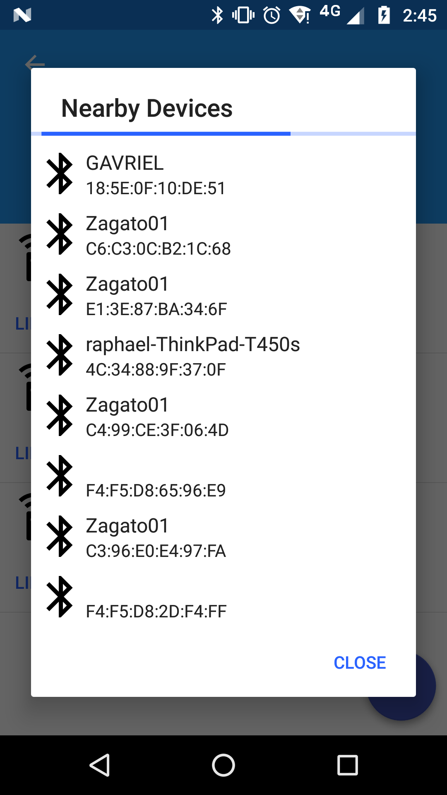

# bt-scan-selector
[](https://jitpack.io/#phearme/bt-scan-selector)

Android dialog for displaying and selecting nearby bluetooth devices. Results are sorted by RSSI level.



## Installation
Add the JitPack repository to your root **Project** gradle file at the end of repositories:
```gradle
allprojects {
	repositories {
		...
		maven { url 'https://jitpack.io' }
	}
}
```
Add the dependency to the **Module** gradle file:
```gradle
dependencies {
	...
	compile 'com.github.phearme:bt-scan-selector:1.1.7'
}
```
Enable databinding in the **Module** grade file:
```gradle
android {
    ...
    dataBinding {
        enabled = true
    }
}
```

## Usage
```java
BTScanSelectorBuilder.build(MainActivity.this, new ABTScanSelectorEventsHandler() {
	@Override
	public void onDeviceSelected(BluetoothDevice device) {
		Log.d("DEBUG", String.format("device selected by user: %s\t%s", device.getName(), device.getAddress()));
	}
}, "Dialog Title");
```
### Filter out devices
Filtering out devices is possible by overriding the `onDeviceFound` method. Return `true` if you want the device to be included in the result, `false` otherwise.
```java
BTScanSelectorBuilder.build(MainActivity.this, new ABTScanSelectorEventsHandler() {
	@Override
    	public boolean onDeviceFound(BluetoothDevice device) {
        	return device.getName().equals("myDevice") || device.getAddress().equals("AA:BB:CC:DD:EE:FF");
    	}
    
    	@Override
	public void onDeviceSelected(BluetoothDevice device) {
		Log.d("DEBUG", String.format("device selected by user: %s\t%s", device.getName(), device.getAddress()));
	}
});

```
